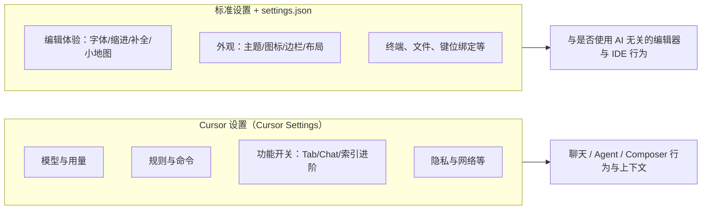

# Cursor 设置与功能入门（新手向）

> **说明**：Cursor 基于 Visual Studio Code（VS Code），因此存在**两套**设置体系：一是 **「Cursor 设置」**（控制 AI、模型、索引、规则等），二是 **「VS Code 风格设置」**（字体、主题、缩进、终端等编辑器行为）。以下名称以当前常见版本为准，**小版本升级后部分菜单、开关名称可能微调**，以本机界面为准。

---

## 1. 如何打开设置

| 方式 | 作用 |
|------|------|
| **标准设置（VS Code 继承）** | 菜单 `File` → `Preferences` → `Settings`，或按 `Ctrl + ,`（macOS 多为 `⌘ + ,`）。在左侧按分类浏览，或在顶部搜索框输入关键词（如 `format on save`）。 |
| **Cursor 设置（AI 与产品功能）** | 菜单 `Cursor` → `Settings` → **`Cursor Settings`**，打开**独立**的 Cursor 设置面板。 |
| **打开 JSON 配置文件** | 在标准设置里点右上角 `Open Settings (JSON)` 图标，可编辑**用户** `settings.json`（可含注释）。**工作区**设置位于项目下的 `.vscode/settings.json`。 |
| **命令面板** | `Ctrl + Shift + P` / `⌘ + Shift + P`，可搜索如 `Preferences: Open User Settings` 等命令。 |

**用户设置 vs 工作区设置**：

- **用户设置**：对当前本机、所有项目默认生效。文件位置见下文「设置文件在哪里」。
- **工作区设置**：仅对当前项目生效，**团队可随仓库共享** `/.vscode/settings.json`，适合项目专属格式化、不同解释器版本等。

---

## 2. 两套体系分别管什么

---

## 3.「Cursor 设置」面板：类别与作用概览

以下对应 **`Cursor` → `Settings` → `Cursor Settings`** 中**常见**的侧栏/分区（产品迭代中名称可能略不同）。

### 3.1 General（通用 / 总览）

| 作用 |
|------|
| 与账号、更新通道、**从 VS Code 导入配置**、部分全局体验相关的入口。实际「通用」子项以你看到的界面为准，用于快速完成迁移与基础偏好。 |

### 3.2 Models（模型）

| 作用 | 常见可配置内容 |
|------|----------------|
| 控制**哪些模型**出现在选择器中、默认模型、以及是否使用/关联 **自有 API 密钥**（视账号与产品策略而定，界面会说明计费方式）。 | 在聊天、内联（如 Cmd/Ctrl+K 类工作流）等场景**切换与固定默认模型**；对「高级」或长上下文模型可能有单独开关。 |

**新手提示**：模型列表与价格策略会更新；遇到「找不到某模型」时，先看本页与账号套餐说明。

### 3.3 Features（功能）—— Cursor 与 AI 最相关的细分区

`Features` 下通常再分子项，**下面按子项说明**。

#### （1）Cursor Tab（行内/片段补全）

| 配置意图 | 说明 |
|----------|------|
| 启用/关闭 **Tab 补全** | 在输入代码时，灰色「幽灵文本」式建议，按 `Tab` 接受。可在此关闭以省电或换习惯。 |
| 高级/实验特性 | 可能包含**更 aggressive 的建议**、多光标相关行为等（以界面文案为准），开启前建议阅读提示。 |

**与 Chat 区别**：Tab 是**无对话**的即时补全；不依赖你在 Chat 里说了什么（除非产品另有设计）。

#### （2）Chat & Composer

| 常见选项 | 作用 |
|----------|------|
| **联网搜索 / 始终联网** | 对查询附加网页检索，获得更新信息，但可能**更慢、更费用量**。 |
| **自动滚到底部** | 新消息流式输出时，若你在消息底部，是否自动上滚。 |
| **新对话时是否显示历史/上下文相关选项** | 影响新开线程时的空状态与历史记录展示（具体名称因版本略有差异）。 |
| **长讨论/多标签（Chat tabs）** | 并行多个对话标签，与变更日志中的新标签、焦点提示等配合使用。 |
| **默认对话模式 / Custom modes（若可用）** | 选择如 Agent、Ask、或**自定义模式**；自定义模式可组合**工具、提示、快捷键绑定**等（Beta 时入口见设置内说明）。 |
| **动画、窄滚动条、标签折叠/输入框展示** | 影响聊天窗「观感」和密度，不本质改变模型能力。 |
| **“粘贴/应用到上下文外文件”类选项** | 控制 Agent/Composer 是否自动把建议应用到**非当前关注文件**（名称以你界面为准，与跨文件改动的安全策略有关）。 |
| **Iterative lint（若标注 Beta）** | 在部分流程中**反复跑 linter 并修**，提升一致性，但可能更耗时。 |

**Composer** 在多数版本里与「多文件编辑/较大范围改动」强相关，细粒度设置常出现在同一分区或相邻入口。

#### （3）Codebase Indexing（代码库索引）

| 配置项 | 作用 |
|--------|------|
| **默认可索引新文件 / 新目录** | 新加入的文件是否自动进索引，便于 @codebase 类上下文；**超大仓库**可关闭自动以减轻本机/云端负担。 |
| **超过文件数自动不索引** | 文档/社区中常见：仅当**大致小于某数量级（如 1 万文件级）**的文件夹才自动建索引，避免误索引整个盘。实际阈值以**官方/界面**为准。 |
| **忽略列表（Ignore）** | 在 **`.gitignore` 之外**再排除**构建产物、巨型资源、机密密钥**等，避免进索引。 |
| **Git Graph / 关系** | 用 **Git 历史** 辅助理解**文件/模块间关系**；会涉及**本地**代码与**部分元数据/混淆信息**的说明（隐私说明见产品文档）。**关闭**可减少对历史的依赖。 |

**新手建议**：小项目可开「自动」；**单体仓库极大**时务必配置 ignore。

#### （4）Docs（文档索引）

| 作用 |
|------|
| 为 **@Docs 或“文档 as 上下文”** 类能力配置要关联的**外部文档/站点**（视版本而定）。适合经常查某套官方文档的团队。 |

#### （5）Editor（在 Cursor 设置里的“编辑器增强”，非整个 VS Code 设置）

| 常见项 | 作用 |
|--------|------|
| **自动解析/结构化编辑相关** | 对 AI 展示 diffs、**主题化 diff** 等，使改动更易读。 |
| **与 AI 协作展示相关的开关** | 如「是否用标签代替大段代码块」等（名称因版本不同），**影响 UI，不替代** 你在 VS Code 里设的字体与主题。 |

#### （6）Terminal（与终端相关的 AI/集成）

| 作用 |
|------|
| 与 **终端 + AI 辅助**（如终端内快捷操作、与 Agent 的协同）相关；具体以本机列表为准。 |

### 3.4 Rules, Commands, Memories（规则、命令、记忆等）

| 子类 | 作用 |
|------|------|
| **User Rules** | 写在设置里的**全局**指令，多用于语气、通用编码偏好；**对 Agent/Chat 生效**（不替代 Tab 补全规则，Tab 有独立行为）。 |
| **Project Rules** | 项目内 `.cursor/rules/*.mdc` 等，可 **按 glob**、**始终应用** 或 **智能/手动 @** 引用；**适合团队共享**。 |
| **AGENTS.md / 类似入口** | 在仓库根**简单声明**对 Agent 的说明；与 Rules 可并存。 |
| **团队规则（Team/Enterprise，若有）** | 从控制台下发，有**强制/可选**等策略，**优先级**通常高于项目与用户规则。 |
| **Commands / Skills 相关（若出现）** | 管理可复用命令、技能等入口（随版本与套餐变化）。 |

**冲突顺序（常见说明）**：**团队规则 > 项目规则 > 用户规则**；具体以官方文档为准。

### 3.5 Privacy / 隐私与数据

| 作用 |
|------|
| 控制**是否允许用于改进产品**、**遥测/日志** 等相关选项（**具体项与法域/企业策略** 有关，以你界面及隐私政策为准）。企业部署可能有额外管理策略。 |

### 3.6 Agent 相关（常出现在侧栏或嵌套在 Features 中）

| 作用 |
|------|
| **自动运行/批准工具**、**提交归属**、**可访问范围** 等与 Agent 长任务相关的策略；**企业**可能有管理员锁定项。与「在聊天里用工具跑终端/读文件」安全模型直接相关。 |

若找不到某项：用设置页**搜索框**或 **Changelog/帮助站** 查最新位置。

### 3.7 Network / 代理 / 企业网（若显示）

| 作用 |
|------|
| 在受限网络中配置**代理、证书、API 基址**等，保障模型与功能可用。 |

---

## 4. 标准「设置」（Ctrl + ,）中的 VS Code 式分类

在 **「设置」** 左侧树状列表中，常见**顶级类**与**它们管什么**如下。每一类下还有**大量子项**；下面列出**子方向**和**代表选项**（不是穷举，穷举会占数百页）。

### 4.1 Commonly Used / 常用

- **速览你最常改的项**（如字体大小、制表符、换行、保存时格式化），多数是下面各类的「快捷入口」。

### 4.2 Text Editor（文本编辑器）

| 子方向 | 代表选项与作用 |
|--------|----------------|
| 字体/外观 | `Editor: Font Size`、`Font Family`、**连字/抗锯齿**等。 |
| 换行/空白 | `Word Wrap`、**自动去除尾随空格**、**结尾换行**等。 |
| 缩进与结构 | `Tab Size`、`Insert Spaces`、**检测缩进**、**括号对着色** 等。 |
| 小地图/滚动 | `Minimap` 开关、比例；**滚动条**行为。 |
| 建议与补全 | **快速建议**、**接受建议的按键**、**内联补全**（与 Cursor Tab 叠加时注意体验）。 |
| 格式化 | **默认格式化程序**、**Format On Save**、**Format On Type**。 |
| 多光标/选择 | **多光标修饰键** 等。 |

### 4.3 Workbench（工作台）

| 子方向 | 作用 |
|--------|------|
| 外观与布局 | `Color Theme`、**图标主题**、**侧栏位置**、**活动栏**、**编辑器标签** 行为。 |
| 面包屑、树 | 资源管理器、大纲等。 |
| 状态栏/通知 | 状态栏项、通知区行为。 |

### 4.4 Window / 窗口

- **新窗口/打开/缩放** 等行为；多显示器/远程桌面场景常用。

### 4.5 Features / 功能

- VS Code 的 **产品功能** 开关；与上面 **Cursor 的 `Features` 重名时**，注意**当前窗口标题** 是 `Settings` 还是 `Cursor Settings`，别混了。

### 4.6 Application / 应用程序

- **自动更新、启动行为、与系统集成** 等；部分项与 Cursor/VS Code 壳相关。

### 4.7 Security / 安全

- **工作区信任（Workspace Trust）**、**受限模式** 等，打开陌生仓库时很重要。

### 4.8 Terminal / 终端

| 子方向 | 作用 |
|--------|------|
| Shell 与配置 | 默认 shell、**配置文件路径**、**环境变量** 等。 |
| 外观/交互 | 终端字体、滚动、复制粘贴行为。 |
| 集成 | **终端与任务** 与外部集成相关选项。 |

### 4.9 Extensions

- **只读/聚合扩展贡献的设置**；安装某个语言或框架扩展后，会多出大量项。

---

## 5. 设置文件与 JSON 键（进阶）

| 位置 | 说明 |
|------|------|
| **用户 `settings.json`** | Windows: `%APPDATA%\Cursor\User\settings.json`；macOS: `~/Library/Application Support/Cursor/User/settings.json`；Linux: `~/.config/Cursor/User/settings.json`。 |
| **工作区** | 项目根目录 `.vscode/settings.json`。 |
| **JSONC** | 支持 `//` 与 `/* */` 注释，**注意** JSON 语法与逗号。 |

**常用键名示例（VS Code 继承）**：

| 用户意图 | 键名示例 |
|----------|----------|
| 字号 | `editor.fontSize` |
| Tab 宽度 | `editor.tabSize` |
| 保存时格式化 | `editor.formatOnSave` |
| 换行 | `editor.wordWrap` |
| 主题 | `workbench.colorTheme` |
| 小地图 | `editor.minimap.enabled` |
| 自动保存 | `files.autoSave` |
| 行号 | `editor.lineNumbers` |
| 括号配对着色 | `editor.bracketPairColorization.enabled` |
| 光标外观 | `editor.cursorStyle` |
| 终端字号 | `terminal.integrated.fontSize` |

**Cursor 产品特有项** 常以 `cursor.` 等前缀出现（**以你本机及文档为准**；部分**仅存于** Cursor 设置 UI/内部存储，不一定全部在 `settings.json` 可见）。

---

## 6. 功能与界面对照（给新手的“地图”）

| 你看到的界面 | 做什么 | 和设置关系 |
|--------------|--------|------------|
| **Chat / 侧边聊天** | 多轮对话、@ 文件/文档/规则；常含 **Agent 模式** | `Cursor Settings` → `Features` / `Models` / `Rules` |
| **Composer** | 多文件/大范围改动、任务流 | 同上，**Chat/Composer 分区** + 工作区/规则 |
| **inline edit（如 Cmd/Ctrl+K 类）** | 在文件中局部改写选区 | 模型/编辑器与 Cursor 的 Editor 子项可能都有关 |
| **Tab 幽灵补全** | 行内续写，按 Tab 接受 | `Features` → **Cursor Tab** + VS Code 的**内联/建议**相关 |
| **@Codebase** | 用索引回答仓库问题 | `Codebase Indexing` + 忽略表 |

---

## 7. 学习路径建议（按顺序做一遍）

1. 打开 **标准设置**，设好 **主题、字体、换行、保存时格式化、缩进、终端字体**。  
2. 打开 **Cursor Settings** → **Models**，确认**账户可用模型**与**默认选择**。  
3. 在 **Codebase Indexing** 中配置 **忽略路径**，大仓库**关闭**盲目自动全索引。  
4. 在 **Features → Chat** 中根据习惯打开/关闭**联网、自动滚屏、默认模式**（有 Custom modes 时再看 Beta 说明）。  
5. 写一条 **User Rule** + 一条 **项目 Rule（`.cursor/rules`）**，体会**何时注入上下文**。  
6. 有团队/企业时，阅读 **Agent 与隐私** 相关项与管理员策略。

---

## 8. 进一步阅读（官方/帮助，链接可能随站点改版）

- 帮助中心关于 **Rules** 等：可在浏览器搜索 `Cursor` + `Rules` + `help` 或 `docs`。  
- 版本新特性：关注 **Changelog**（`cursor.com` 的发行说明）以查 **设置项位置迁移** 或 **新开关**。

---

*文档目的：为新手提供「设置分哪几块、点哪里、解决什么问题」的索引；*  
*若你使用的 Cursor 与本文描述有出入，**以你当前版本的界面与官方帮助为准**。*
